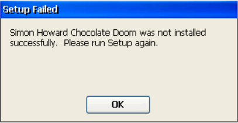
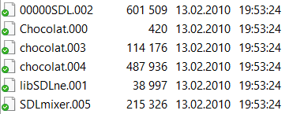

# doom-arm-ce
Doom for WindowsCE, ARM based cpu.

Použitá distribuce je oblíbený Chocolate Doom ve verzi 1.3.0, která jako jediná byla zkompilovaná pod WindowsCE:
- link:[www.chocolate-doom.org/downloads/1.3.0/](https://www.chocolate-doom.org/downloads/1.3.0/)
- lokální kopie: [chocolate-doom-1.3.0-wince.cab](chocolate-doom-1.3.0-wince.cab)

Pokud se instalace povede, máte vyhráno, ale je pravděpodobnější, že skončí s chybou:


Pak bude nutné, na počítači, CAB soubor rozbalit (7-zip to zvládne). Dostaneme podobný balast se kterým musíme dál pracovat:



Naštěstí umíme z originálního CAB souboru dostat správné názvy, toto je začátek souboru, který nám ale postačí:

```
MSCF    ţB     ,           Ň  Ú   -   ¤        M<¬ž  Chocolat.000 I ¤    M<¬ž  SDLmixer.005  r ÂJ   M<¬ž  chocolat.004  ľ ÂĽ
   M<¬ž  chocolat.003 Ą-	 Âz   M<¬ž  00000SDL.002 U˜  g¨   M<¬ž  libSDLne.001 Y΃ € €MSCE    ¤         
                                  d   č   đ   „  „  „  h  | 
         Chocolate Doom    Simon Howard            %CE8%\Chocolate Doom      Chocolate Doom Setup.lnk      Chocolate Doom.lnk               libSDL_net-1-2-0.dll            SDL.dll         chocolate-setup.exe         chocolate-doom.exe          SDL_mixer.dll                       MZ       ˙˙  ¸       @                                   €   ş ´	Í!¸LÍ!This program cannot be run in DOS mode.
 ```

 Pak už jen zbývá přejmenovat soubory:

```
Chocolat.000 -> toto je jen zástupce na plochu
SDLmixer.005 -> SDL_mixer.dll
chocolat.004 -> chocolate-doom.exe
chocolat.003 -> chocolate-setup.exe
00000SDL.002 -> SDL.dll
libSDLne.001 -> libSDL_net-1-2-0.dll
```
A vytvořit dávku pro spuštění `start.cmd` s tímto obsahem:

```
chocolate-doom.exe -iwad doom1.wad
```

Pozor, ještě si musíte dodat WAD soubor! Zde uvedený `doom1.wad` je shareware verze DOOM1.